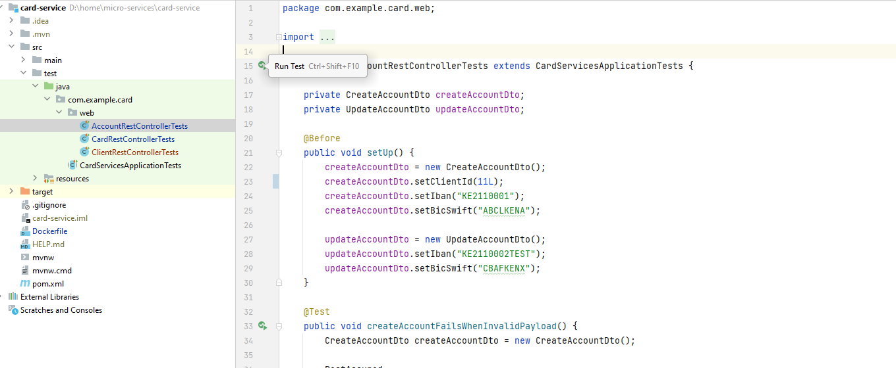

## Project is a Spring Boot version 3.2.2

1. The application runs on port __18080__
2. To access swagger documentation open link http://localhost:18080/api-docs-ui.html

#### To run the application in docker
#### Prerequisite
1. Docker version 24+
2. Docker Compose Docker 2.23.3+

#### Steps
1. Run the commands
    1. __docker compose build__
    2. __docker compose up__

### To run the application in IDE (eg Intellij)
#### Prerequisite
1. JDK 17+
2. Maven 3.9.6
3. Postgres

#### Steps
1. Open the project card-service
2. Create a database under postgres with the name __card_services_db__
3. Update property file __application-local.properties__ with correct postgres credentials as per you local instance
4. Run the project from Intellij

### To run the project Test cases in IDE (eg Intellij)

#### Steps
1. Open the project card-service
2. Navigate to test package
3. Navigate to web package
4. 

### To Rebuild the project
#### Prerequisite
1. JDK 17+
2. Maven 3.9.6

#### Steps
1. Open a terminal
2. Navigate to directory card-service
2. Run the command __mvn clean install -Puat -DskipTests__